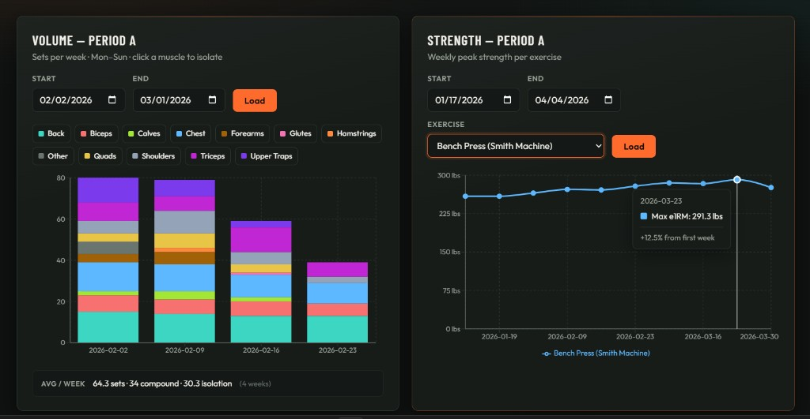
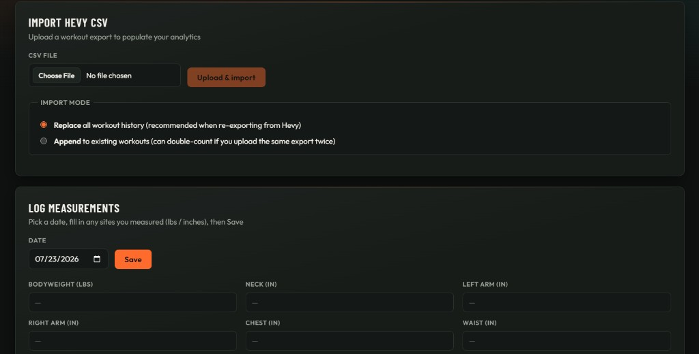

# LiftLedger

**Training analytics from Hevy exports. Volume. Strength. Size.**

LiftLedger turns Hevy CSV workout exports into a personal training analytics dashboard. Import set-level history into Postgres, map exercises to muscle groups, and explore weekly volume, estimated strength trends, and body measurements through interactive Recharts charts.

<!-- Drop screenshots into docs/screenshots/ then uncomment:



-->

## Inspiration

How much training volume you should be doing for optimal muscle growth and strength gain is a highly debated topic in the fitness industry. Analyzing training volume and progress usually means scrscolling Hevy history or guessing from memory. I wanted a clearer picture using my own training data: how volume is distributed across muscles week to week, how much strength is actually moving (e1RM), and how body measurements track alongside training — without rebuilding my logbook by hand.

LiftLedger is that layer on top of Hevy: keep logging in the gym app you already use, export when you want insights, and analyze the full history in one place.

## How It's Built

### Frontend

- **React + Vite + TypeScript**
- **React Router** for Dashboard, Log data, and Sets by muscle
- **Recharts** for volume bars, strength trends, measurement lines, and scatter plots
- Custom CSS (chalk-on-iron fitness theme)

### Backend

- **Express** API (`/api/import`, `/api/analytics`, `/api/measurements`)
- **Prisma** ORM against **PostgreSQL** (Neon-friendly)
- **Multer + csv-parse** for Hevy CSV ingestion
- Batched workout inserts (40 at a time) so large exports finish reliably

### Data model

Normalized schema for:

- **Workouts / sets** (reps, weight + unit, set kind, order)
- **Exercises** seeded from unique Hevy CSV titles (muscle group, compound vs isolation, strength-tracking mode)
- **Body measurements** (lbs / inches by site)
- **CSV import** audit records (status, filename, skip stats)

Exercise rows stay close to Hevy naming (e.g. `Bench Press (Barbell)` vs `Bench Press (Dumbbell)` stay separate) so strength trends aren’t mixed across equipment. A small merge map only collapses clear spelling variants (e.g. `Ring dip` → `Ring Dips`).

## Core Features

- **Hevy CSV import** — replace or append modes; unknown exercises are skipped and counted
- **Exercise library from your export** — `db:seed:exercises` builds exercises (and lookup rows) from unique titles in a Hevy CSV, then classifies muscle / type / strength mode
- **Weekly volume** — SQL aggregation by week and muscle; stacked muscle bars with click-to-isolate drill-down into compound vs isolation sets
- **Calendar-span averages** — empty weeks don't inflate “sets per week”
- **Strength trends** — weekly max estimated 1RM (Epley, lbs) or max reps, with % change vs the first week in range
- **Sets by muscle** — raw session-level set log outside weekly buckets
- **Body composition** — multi-site logging, all-time trend charts, same-day scatters (bodyweight vs circumference, waist vs circumference)

### At a glance

| Piece | Count |
| --- | --- |
| Muscle groups | 12 |
| Measurement sites | 9 |
| Analytics API routes | 7 |

A full personal export has been imported successfully at roughly **~650 workouts / ~10k+ sets**. Exercise count depends on how many distinct titles appear in your Hevy CSV.

## Challenges

- **Large CSV imports** — interactive transactions timed out on ~15k-row exports; fixed with batched inserts and disabled request timeouts for the import path
- **Exercise identity vs strength trends** — early “merge everything into one Bench Press” mapping polluted e1RM; seeding from CSV titles (with only light spelling merges) fixed that

## Vision

Possible next steps:

- Auth and multi-user isolation for a deployable public app
- Progress UI / polling for CSV imports instead of a single long POST
- Multi-exercise strength comparison chart
- Progress photo attachments on measurement checkpoints
- LLM-assisted muscle-group suggestions for new exercises, confirmed by the user before saving

## Tech Stack

| Layer | Technologies |
| --- | --- |
| Frontend | React, Vite, TypeScript, React Router, Recharts |
| Backend | Node.js, Express, Multer, csv-parse |
| Database | PostgreSQL, Prisma, Neon |
| Source data | Hevy CSV exports |

## Getting Started

### Prerequisites

- Node.js 20+
- A PostgreSQL database (local or [Neon](https://neon.tech))

### Clone

```bash
git clone https://github.com/adeebnawshad/LiftLedger.git
cd LiftLedger
```

### Backend setup

```bash
cp .env.example .env
# Set DATABASE_URL (and later DEFAULT_USER_ID after seeding)
npm install
npm run db:migrate
npm run db:seed
```

`db:seed` creates a local user and seeds the exercise library from the sample Hevy export at `backend/fixtures/workouts.csv` (included in the repo — fine to use as-is for a first run). To seed from your own export instead (so titles match what you'll import):

```bash
npm run db:seed:exercises -- path/to/your/workouts.csv
```

Copy the seeded user's id into `.env` as `DEFAULT_USER_ID`, then start the API:

```bash
npm run dev
```

API defaults to [http://localhost:3000](http://localhost:3000) (`GET /health` should return `OK`).

### Frontend setup

```bash
cd frontend
npm install
npm run dev
```

Open [http://localhost:5173](http://localhost:5173). Vite proxies `/api` to the Express server.

### Import a Hevy export

1. In Hevy: export workouts as CSV  
2. Open **Log data** in LiftLedger  
3. Choose **Replace** (full refresh) or **Append**, then upload  

Large files can take several minutes.

If you import titles that weren’t in the seed CSV, re-run seed with that export so those names resolve; otherwise those sets are skipped:

```bash
npm run db:seed:exercises -- path/to/your/workouts.csv
```

## Project layout

```
LiftLedger/
├── backend/           # Express API, import + analytics + measurements
├── frontend/          # React (Vite) dashboards
├── prisma/            # Schema, migrations, CSV exercise seeding
├── docs/screenshots/  # Optional README images
└── package.json       # Root scripts (db + API)
```
